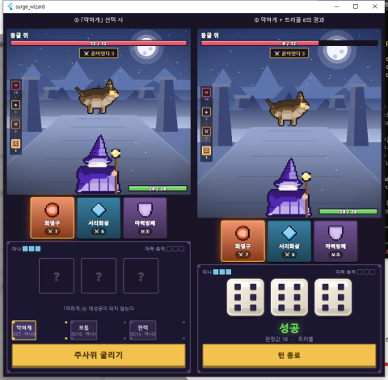

# 보고서 02 — 밸런스 창 수정 (검토서 01 대응)

작성: 2026-09-01 / 근거: `reports/01_balance_task1-2_REVIEW.md` 수정 요청 1·2

## 1. 한 줄 요약

「약하게」 강등을 화면·집계 전체에 반영하고 무료 리롤이 비용 회차를 올리지 않게 고쳤다.
검토서가 예측한 허수 3.7%p가 실측 3.5%p로 확인됐고, 완주율이 30.7%로 목표 상단을 0.7%p 넘겼다.

## 2. 이행 여부

| 항목 | 상태 | 어떻게 |
|---|---|---|
| 수정 1-① UI·연출·로그가 적용 등급을 따른다 | ✅ 완료 | `Battle.lastAppliedGrade` 신설. 배너(`ResultBanner`가 `grade`를 밖에서 받는다)·플래시/효과음(`battle_fx.dart`)·이펙트 크기(`lastCastPower`)가 전부 이 값을 본다. 로그는 이미 `effectiveGrade()` 기준이라 그대로 |
| 수정 1-② `gradeCounts` 집계를 적용 등급으로 | ✅ 완료 | `applyGrade()`에서 강등된 등급으로 집계 |
| 수정 1-③ 「약하게」 규칙을 화면에 한 줄 노출 | ✅ 완료 | 주문 선택 단계에서 「약하게」를 고르면 *"「약하게」는 대성공이 되지 않는다"* 표시. **비어 있던 족보 줄 자리(58px)를 재활용해 화면 높이는 그대로다** |
| 수정 1 재측정 후 `BALANCE.md` 4차 분포표 갱신 | ✅ 완료 | 분포표뿐 아니라 4차 절의 **모든 수치를 재측정값으로 갱신**했다 (아래 4번 참조) |
| 수정 2 무료 리롤은 비용 회차를 올리지 않는다 | ✅ 완료 | `DicePool`에 `paidRerollCount` 신설. `reroll({bool free})`가 무료면 유료 회차를 올리지 않는다. 최대 3회 제한에는 그대로 포함. 화면(`battle_controller.dart`)과 시뮬레이터 봇(`sim_core.dart`) 양쪽 적용 |
| 수정 1은 화면 변경이므로 480px 스크린샷 첨부 | ✅ 완료 | 3번 |

고친 파일: `core/battle.dart`, `core/dice.dart`, `screens/battle_controller.dart`,
`screens/battle_screen.dart`, `widgets/result_banner.dart`, `widgets/battle_fx.dart`,
`tool/sim_core.dart`, `test/battle_test.dart`, `BALANCE.md`.

## 3. 화면 확인 (480px)

- **왼쪽 ①** — 「약하게」를 고른 상태. 주사위 자리 아래에
  *"「약하게」는 대성공이 되지 않는다"* 안내가 뜬다.
- **오른쪽 ②** — 「약하게」로 **트리플 6**(판정값 18, 원래는 확정 대성공)을 띄운 결과.
  배너가 **「성공」**(초록)으로 뜨고 족보는 「트리플」로 정직하게 표시된다.
  대성공 금색 배너·흰 플래시·1.8배 이펙트가 모두 뜨지 않는다. 고치기 전에는
  여기서 「대성공!」이 떴다.

촬영을 위해 임시 진입점 `lib/dev_screenshot.dart`를 만들어 두 상태를 한 화면에
띄운 뒤 **촬영 후 삭제했다** (좌표를 찍어 클릭을 반복하지 않으려는 목적).
`build/` 안의 실행 파일은 이 임시 진입점으로 빌드된 것이 남아 있다. 다음 빌드 때
정상 진입점으로 덮어써지며, CLAUDE.md LESSONS에 따라 `build` 폴더는 지우지 않았다.

## 4. 수치 결과 (재측정)

`dart run tool/simulate.dart` 1000판, 시드 20260831, 무강화. **수정 전 = 보고서 01의 값.**

| 지표 | 개정 전 | 수정 전 | **수정 후** | 목표 | 달성 |
|---|---|---|---|---|---|
| 폭주 빈도 | 1.0% | 10.2% | **10.3%** | 6~10% | ⚠ 상단 0.3%p 초과 (검토서에서 A안으로 판정 완료) |
| 완주율 | 25.3% | 28.9% | **30.7%** | 15~30% | ⚠ **상단 0.7%p 초과 (새로 발생)** |
| 「전력」 사용 | — | 69.5% | **69.6%** | 20% 이상 | ✅ |
| 3~5층 사망률 | 0.9/1.9/9.1% | 3.2/3.6/3.1% | **3.2/4.2/2.9%** | 20% 이하 | ✅ |

### 판정 결과 분포 — 검토서의 예측이 맞았다

| | 대성공 | 성공 | 아슬아슬 | 실패 |
|---|---|---|---|---|
| 수정 전 (원본 등급 집계) | 38.0% | 34.7% | 17.1% | 10.2% |
| **수정 후 (적용 등급 집계)** | **34.5%** | **38.2%** | 17.1% | 10.2% |

허수는 **3.5%p**였다. 검토서가 계산한 "약 3.7%p"와 거의 일치한다.
대성공과 성공의 순위가 뒤집혔다 — 이제 성공이 가장 흔한 결과다.

### 층별 사망률 (%)

| 층 | 1 | 2 | 3 | 4 | 5 | 6 | 7 | 8 | 9 | 10(보스) |
|---|---|---|---|---|---|---|---|---|---|---|
| 수정 후 | 0.0 | 0.8 | 3.2 | 4.2 | 2.9 | 7.1 | 12.3 | 9.9 | 15.7 | 44.5 |

### 봇 성향 민감도 (측정 조건일 뿐, 손잡이로 쓰지 않는다)

| 지표 | 공격적 봇(현재) | 신중한 봇 |
|---|---|---|
| 폭주 빈도 | 10.3% | 10.0% |
| 완주율 | 30.7% | **30.8%** |
| 전력 사용 | 69.6% | 68.4% |

**완주율은 봇 성향과 무관하다.** 폭주와 달리 봇을 신중하게 바꿔도 내려가지 않는다.

## 5. 테스트·검사

- `flutter test`: **139/139 통과** (보고서 작성 직전 재실행). 실패 없음.
  - 136개 → 신규 3개: 「약하게」 강등이 화면·집계 양쪽에 반영된다 /
    「보통」 대성공은 강등되지 않고 그대로 집계된다 / 무료 리롤은 비용 회차를 올리지 않는다.
  - 수정으로 깨진 기존 테스트는 없었다.
- `flutter analyze`: **경고 0건**.
- 실제 실행 확인: **했다** (3번 스크린샷).
- 재현: `dart run tool/simulate.dart` / `flutter test` / `flutter analyze`

## 6. ★ 지시서(검토서)를 벗어난 것

| 무엇을 | 왜 | 되돌릴 수 있나 |
|---|---|---|
| `BALANCE.md` 4차 절의 **분포표 외 수치도 전부 갱신**했다 (완주율·층별 사망률·강도 비율·민감도표). 검토서는 "분포표 갱신"과 "다른 지표는 영향받지 않는다"고 적었다 | 수정 2(무료 리롤)가 **게임 동작을 바꾸는 수정**이라 실제로는 다른 지표도 움직였다(완주율 28.9→30.7%). 옛 수치를 남겨두면 문서가 거짓이 된다. 갱신 사실과 이유를 4차 절 머리에 명시했다 | 예 |
| `ResultBanner`의 생성자에 `grade`를 **필수 인자로** 추가했다 (기본값을 두지 않았다) | 기본값을 두면 나중에 누가 빠뜨렸을 때 조용히 옛 버그로 돌아간다. 호출부가 한 곳뿐이라 비용이 없다 | 예 |
| 무료 리롤 처리를 `BattleController`가 아니라 **`DicePool`에** 넣었다 | 회차 계산을 리셋하는 곳(`rollAll`/`seed`)이 `DicePool`이라 여기 두어야 리셋이 한 곳에서 끝난다. 화면과 시뮬레이터 봇이 같은 규칙을 공유하는 이점도 있다 | 예 |
| 스크린샷용 임시 진입점 `lib/dev_screenshot.dart`를 만들었다가 삭제했다 | 3번 참조. 클릭을 반복해 스크린샷을 낭비하지 않기 위해서 | 이미 삭제됨 |

`INDEX.md`·`GAME_DESIGN.md`·`WORK_ORDER_BALANCE.md`·`check.dart`·`combo.dart`·
확률표·DC·주사위 개수는 건드리지 않았다. **게임 밸런스 수치도 하나도 바꾸지 않았다.**

## 7. ★ 판단이 필요한 것

### 질문 — 완주율 30.7%로 목표 상단을 0.7%p 넘겼다

수정 2로 유물 「무료 리롤」이 제값을 되찾으면서 생긴 결과다. 되돌리면 그 유물이
다시 조용히 약해지므로 **되돌릴 수는 없다.**

| 선택지 | 결과 |
|---|---|
| **A. 이대로 둔다** (권장) | 0.7%p는 시드 하나로 흔들리는 폭이다. 봇은 유물을 항상 최적으로 굴리는 상한 플레이라 사람은 이보다 낮다. 검토서가 폭주 0.2%p 초과에 대해 내린 판단("목표 범위는 판단 기준이지 규격이 아니다")과 같은 논리가 그대로 적용된다 |
| B. 유물 밸런스를 손본다 | 무료 리롤 유물의 지급 횟수를 줄이는 식. 다만 방금 제값을 찾아준 유물을 곧바로 깎는 셈이고, 완주율 말고는 어긋난 지표가 없다 |
| C. 작업 3(상점) 이후로 판단을 미룬다 | 상점 경제가 들어가면 완주율이 또 움직인다. 지금 맞춰봐야 다시 재야 한다 |

A 또는 C를 권한다. 어느 쪽이든 **작업 3 이후 재측정이 필요하다**는 점은 같다.

그 외 검토서의 질문 1~3에 대한 답변(폭주 A안 채택 / 전력은 손대지 않음 /
화면 변경 시 스크린샷 필수)은 전부 수용했고, 이견 없다.

## 8. 다음 작업

**작업 3(상점 경제)**. 검토 결과를 받고 시작한다.
작업 4(확정 굴림) 후에는 검토서가 예측한 "확정 굴림이 「보통」을 더 많이 올려
전력 편중을 완화한다"를 시뮬레이션으로 검증해야 한다 — `BALANCE.md` 4차 절에 메모해 뒀다.
